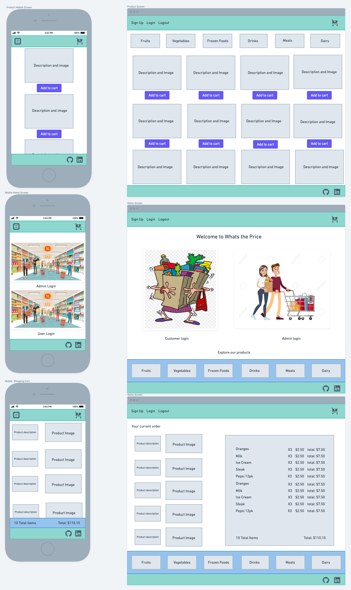

# Whats-the-Total

# README

## Overview

This README would normally document whatever steps are necessary to get the
application up and running.

### App Name

Whats-the-Total

### Description

This is a grocery store/shopping cart app where admins are able to create and manage grocery store products. The user/customer is able to browse and add items to their shopping cart. The admins/owners are able to checkout the user/customers.

 

## MVP

- Functional models, controllers, and routes for the rails backend
- Functional CRUD operations for products and categories for the market
- Reactive CSS design for mobile and destkop
- Working design and functionality for all screens
- Users can add and remove items from their carts
- Pricing works for shopping cart

### Libraries and Dependencies

- Deployment instructions

|    Library    | Description               |
| :-----------: | :------------------------ |
|     React     | frontend library          |
| React Router  | routing library for react |
| Ruby on Rails | backend library           |
|   Tailwind    | Styling library           |

#### Wireframes

#### Component Tree

#### Time Estimates

| Task                                  | Priority | Estimated Time | Time Invested | Actual Time |
| ------------------------------------- | :------: | :------------: | :-----------: | :---------: |
| Create Rails application              |          |     1 hrs      |      1hr      |             |
| Rails Scaffold                        |          |     1 hrs      |      3hr      |             |
| Backend Controllers                   |          |     3 hrs      |      5hr      |             |
| Test backend routes                   |          |     2 hrs      |     2hrs      |             |
| deploy backend                        |          |     4 hrs      |     3hrs      |             |
| Create react app                      |          |     2 hrs      |      1hr      |             |
| Screen and components setup for react |          |     2 hrs      |      1hr      |             |
| API configuration setup               |          |     4 hrs      |      3hr      |             |
| Create products for admins            |          |     3 hrs      |    3.5hrs     |             |
| Update products for admins            |          |     3 hrs      |     4hrs      |             |
| Create shopping cart for users        |          |     3 hrs      |     5hrs      |             |
| Add to and delete from shopping cart  |          |     4 hrs      |     6hrs      |             |
| Checkout shopping cart functionality  |          |     4 hrs      |     4hrs      |             |
| Styling screens                       |          |     6 hrs      |     10hrs     |             |
| Styling navbar and footer             |          |     4 hrs      |     3hrs      |             |
| Navbar functionality                  |          |     2 hrs      |    2.5hrs     |             |
| Footer functionality                  |          |     3 hrs      |     4hrs      |             |
| Style footer                          |          |     3 hrs      |     4hrs      |             |
| Test frontend routes and calls        |          |     3 hrs      |     2hrs      |             |
| Refactor code                         |          |     5 hrs      |               |             |
| User authorization backend            |          |     4 hrs      |     2hrs      |             |
| User authorization frontend           |          |     4 hrs      |     3hrs      |             |
| Total                                 |          |     73 hrs     |     71hrs     |             |

 

### Server (Back End)

#### ERD Model

---

## Post-MVP

- Admin specific responsibilities
- Add barcodes for products
- More varieties for the same product (different types of oranges)
- Make user products unique with an increment function
- Sales tax for each state
- State field for user

---

## Code Showcase

This snippet of code is a method designed to remove a product from the shopping cart by deleting it.

def delete_product
@user = User.find(params[:id])
@product = Product.find(params[:product_id])
index = @product.id
@array = @user.products.find_all{|i| i.id == index}
@array.pop
@user.products.delete(params[:product_id])
@user.products << @array
render json: @user.products
end

## Code Issues & Resolutions
