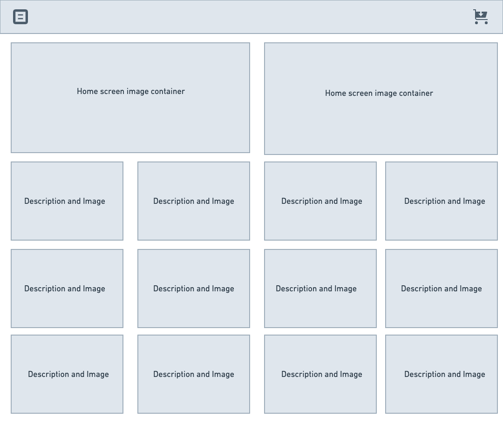
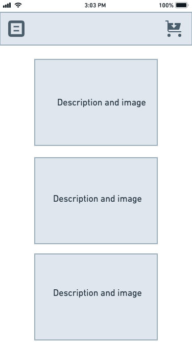
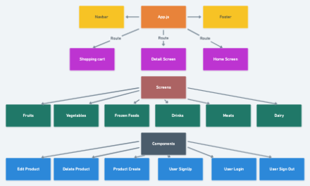
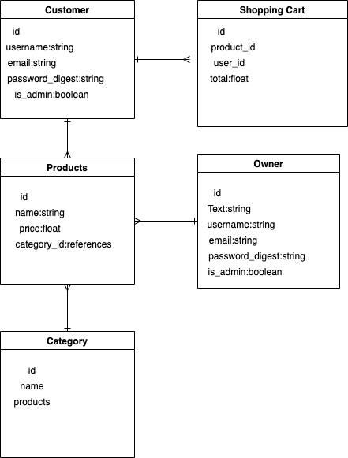

# Whats-the-Total

## Overview

Whats-the-Total

 

## MVP

 

### Goals

- _Lorem ipsum, dolor sit amet,_
- _consectetur adipiscing elit._
- _Phasellus dapibus fermentum risus vitae bibendum._
- _Integer vel ipsum mollis odio sollicitudin ornare eu vel ex._
- _etc._

 

### Libraries and Dependencies

> Use this section to list all supporting libraries and dependencies, and their role in the project. Below is an example - this needs to be replaced!

|     Library      | Description                                |
| :--------------: | :----------------------------------------- |
|      React       | _Lorem ipsum dolor sit amet, consectetur._ |
|   React Router   | _Lorem ipsum dolor sit amet, consectetur._ |
| React SemanticUI | _Lorem ipsum dolor sit amet, consectetur._ |
|     Express      | _Lorem ipsum dolor sit amet, consectetur._ |
|  Express Router  | _Lorem ipsum dolor sit amet, consectetur._ |

 

### Client (Front End)

#### Wireframes

#### Component Tree

#### Time Estimates

> Use this section to estimate the time necessary to build out each of the components you've described above.

| Task                | Priority | Estimated Time | Time Invested | Actual Time |
| ------------------- | :------: | :------------: | :-----------: | :---------: |
| Add Contact Form    |    L     |     3 hrs      |               |             |
| Create CRUD Actions |    H     |     3 hrs      |               |             |
| TOTAL               |          |     6 hrs      |               |             |
| Add Contact Form    |    L     |     3 hrs      |               |             |
| Create CRUD Actions |    H     |     3 hrs      |               |             |
| TOTAL               |          |     6 hrs      |               |             |
| Add Contact Form    |    L     |     3 hrs      |               |             |
| Create CRUD Actions |    H     |     3 hrs      |               |             |
| TOTAL               |          |     6 hrs      |               |             |
| Add Contact Form    |    L     |     3 hrs      |               |             |
| Create CRUD Actions |    H     |     3 hrs      |               |             |
| TOTAL               |          |     6 hrs      |               |             |
| Add Contact Form    |    L     |     3 hrs      |               |             |
| Create CRUD Actions |    H     |     3 hrs      |               |             |
| TOTAL               |          |     6 hrs      |               |             |
| Add Contact Form    |    L     |     3 hrs      |               |             |
| Create CRUD Actions |    H     |     3 hrs      |               |             |
| TOTAL               |          |     6 hrs      |               |             |

 

### Server (Back End)

#### ERD Model

---

## Post-MVP

> Use this section to document ideas you've had that would be fun (or necessary) for your Post-MVP. This will be helpful when you return to your project after graduation!

---

## Code Showcase

> Use this section to include a brief code snippet of functionality that you are proud of and a brief description.

## Code Issues & Resolutions

> Use this section to list of all major issues encountered and their resolution.
